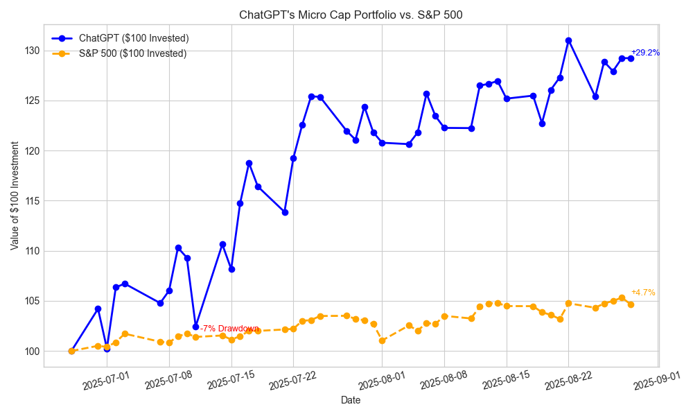

# ChatGPT Micro-Cap Experiment

**AI-Powered Automated Trading System** - A serverless Node.js application where ChatGPT manages a real-money micro-cap portfolio using real-time market data and advanced analytics.

## Overview on getting started: [Here](https://github.com/LuckyOne7777/ChatGPT-Micro-Cap-Experiment/blob/main/Start%20Your%20Own/README.md)

## Repository Structure

- **`src/`** - Main application source code
  - **`handlers/`** - AWS Lambda function handlers (API endpoints & scheduled tasks)
  - **`services/`** - Business logic services (AI, brokerage, market data)
  - **`utils/`** - Utilities (logger, error handler, data migration)
- **`Scripts and CSV Files/`** - Portfolio tracking and performance data
- **`Start Your Own/`** - Template files and guide for starting your own experiment
- **`Weekly Deep Research (MD|PDF)/`** - Research summaries and performance reports
- **`Experiment Details/`** - Documentation, methodology, prompts, and Q&A
- **`serverless.yml`** - Serverless Framework configuration for AWS deployment

## Environment Setup

This project uses two environment files for different purposes:

- **`.env.dev`** - Standard format for local development (`serverless offline`)
- **`.env.dev.json`** - JSON format for AWS deployment

### Managing Environment Variables

To keep both files in sync, use the built-in environment sync utility:

```bash
# Check differences between files
npm run env:diff

# Sync from .env.dev.json to .env.dev (recommended)
npm run env:sync

# Sync from .env.dev to .env.dev.json
npm run env:to-json

# Sync from .env.dev.json to .env.dev
npm run env:to-env
```

**Workflow:** Edit `.env.dev.json` (JSON format) and run `npm run env:sync` to update `.env.dev`.

## Logging System

The project uses a proxy-based batching logger that sends logs to **Logtail** via HTTP POST requests:

### Features

- **Batched HTTP POST**: Logs are batched and sent to Logtail in groups of 10
- **Automatic flushing**: Logs flush every 5 seconds or when batch size is reached
- **Graceful fallback**: Falls back to console logging if Logtail is not configured
- **Context support**: Each logger instance can have its own context
- **Retry mechanism**: Failed log sends are retried up to 3 times

### Usage

```javascript
const Logger = require("./src/utils/logger");

// All these patterns work:

// 1. Constructor pattern (backward compatible)
const logger1 = new Logger("api-service");
logger1.info("User logged in", { userId: 123 });

// 2. Factory method
const logger2 = Logger.create("trading-engine");
logger2.warn("Rate limit approaching", { remaining: 5 });

// 3. Static methods
Logger.info("System started", { version: "1.0.0" });

// 4. Function call (creates default logger)
const logger3 = Logger("custom-context");
logger3.error("Database error", error, { db: "postgres" });

// Business logic methods work with all patterns
Logger.logTradeDecision({
  ticker: "AAPL",
  action: "BUY",
  shares: 100,
  reasoning: "Strong momentum",
  confidence: 0.85,
});

// Manual flush (optional)
await Logger.flush();
```

### Configuration

Set these environment variables to enable Logtail logging:

```bash
LOGTAIL_SOURCE_TOKEN=your_source_token_here
LOGTAIL_ENDPOINT=https://your-endpoint.betterstackdata.com
```

### Testing

Test the logger with the built-in test script:

```bash
npm run test-logger
```

**Note:** Logger now uses the official Logtail SDK for reliable cloud logging with automatic batching and retry mechanisms.

## Quick Start Guide

### 1. Prerequisites

```bash
# Install dependencies
npm install

# Install Serverless Framework globally
npm install -g serverless
```

### 2. Environment Configuration

```bash
# Copy and configure environment files
cp .env.dev.json .env.dev.json.backup
# Edit .env.dev.json with your API keys and configuration
```

### 3. Local Development

```bash
# Start local serverless development environment
npm run offline

# Test API endpoints
curl http://localhost:3001/dev/api/portfolio
curl http://localhost:3001/dev/api/system-status

# Test logging system
npm run test-logger
```

### 4. AWS Deployment

```bash
# Deploy to AWS (requires AWS CLI configured)
npm run deploy:production

# Or deploy to development stage
serverless deploy --stage dev
```

### 5. Environment Variables Required

```json
{
  "AI_API_KEY": "your-openai-api-key",
  "ALPACA_KEY_ID": "your-alpaca-key",
  "ALPACA_SECRET_KEY": "your-alpaca-secret",
  "LOGTAIL_SOURCE_TOKEN": "your-logtail-token (optional)",
  "LOGTAIL_ENDPOINT": "your-logtail-endpoint (optional)"
}
```

## API Endpoints

| Method | Endpoint                       | Description                          |
| ------ | ------------------------------ | ------------------------------------ |
| GET    | `/api/portfolio`               | Get current portfolio status         |
| GET    | `/api/trading-history`         | Get trade execution history          |
| GET    | `/api/system-status`           | Get system health and status         |
| POST   | `/api/trigger-daily-trading`   | Manually trigger daily trading cycle |
| POST   | `/api/trigger-market-research` | Manually trigger market research     |
| PUT    | `/api/configuration`           | Update system configuration          |

## Scheduled Functions

- **Daily Trading** - Runs at 9:30 PM UTC (4 PM ET) for market close decisions
- **Market Research** - Runs at 6 AM ET and 5 PM ET for deep analysis
- **Portfolio Updates** - Runs after market close for P&L calculations
- **Stop Loss Monitoring** - Runs multiple times during market hours
- **Email Reports** - Sends daily performance summaries

## Development Commands

```bash
# Environment management
npm run env:sync          # Sync environment files
npm run env:diff          # Check environment differences

# Testing
npm run test-logger       # Test logging system
npm run test-email        # Test email functionality

# Deployment
npm run offline           # Local development server
npm run deploy:production # Deploy to production
```

# The Concept

Every day, I kept seeing the same ad about having some A.I. pick undervalued stocks. It was obvious it was trying to get me to subscribe to some garbage, so I just rolled my eyes.  
Then I started wondering, "How well would that actually work?"

So, starting with just $100, I wanted to answer a simple but powerful question:

**Can powerful large language models like ChatGPT actually generate alpha (or at least make smart trading decisions) using real-time data?**

## Each trading day:

- I provide it trading data on the stocks in its portfolio.
- Strict stop-loss rules apply.
- Every week I allow it to use deep research to reevaluate its account.
- I track and publish performance data weekly on my blog: [Here](https://nathanbsmith729.substack.com)

## Research & Documentation

- [Research Index](https://github.com/LuckyOne7777/ChatGPT-Micro-Cap-Experiment/blob/main/Experiment%20Details/Deep%20Research%20Index.md)
- [Disclaimer](https://github.com/LuckyOne7777/ChatGPT-Micro-Cap-Experiment/blob/main/Experiment%20Details/Disclaimer.md)
- [Q&A](https://github.com/LuckyOne7777/ChatGPT-Micro-Cap-Experiment/blob/main/Experiment%20Details/Q%26A.md)
- [Prompts](https://github.com/LuckyOne7777/ChatGPT-Micro-Cap-Experiment/blob/main/Experiment%20Details/Prompts.md)
- [Starting Your Own](https://github.com/LuckyOne7777/ChatGPT-Micro-Cap-Experiment/blob/main/Start%20Your%20Own/README.md)
- [Research Summaries (MD)](<https://github.com/LuckyOne7777/ChatGPT-Micro-Cap-Experiment/tree/main/Weekly%20Deep%20Research%20(MD)>)
- [Full Deep Research Reports (PDF)](<https://github.com/LuckyOne7777/ChatGPT-Micro-Cap-Experiment/tree/main/Weekly%20Deep%20Research%20(PDF)>)
- [Chats](https://github.com/LuckyOne7777/ChatGPT-Micro-Cap-Experiment/blob/main/Experiment%20Details/Chats.md)

# Current Performance

<!-- To update performance chart:
     1. Replace the image file with updated results
     2. Update the dates and description below
     3. Update the "Last Updated" date -->

**Last Updated:** August 29th, 2025



**Current Status:** Portfolio is outperforming the S&P 500 benchmark

_Performance data is updated after each trading day. See the CSV files in `Scripts and CSV Files/` for detailed daily tracking._

# Features of This Application

- **REST API Endpoints** - Full HTTP API for portfolio management and system control
- **Scheduled Automation** - Daily trading, market research, and portfolio updates
- **AI-Powered Decisions** - ChatGPT-4 integration for intelligent trade recommendations
- **Real-Time Market Data** - Live price feeds from Alpaca and Yahoo Finance
- **Advanced Logging** - Batched Logtail integration with structured logging
- **Portfolio Analytics** - Real-time P&L tracking and performance metrics
- **Stop-Loss Automation** - Automatic position management and risk controls

# Why This Matters

Can AI truly make smart investment decisions? This project tests the limits of AI-driven trading with:

- **Real money deployment** - Live trading with actual capital
- **Transparent methodology** - Open-source code and decision processes
- **Data-driven validation** - Comprehensive performance tracking
- **Scalable architecture** - Serverless design for reliability and cost efficiency

# Tech Stack & Architecture

## Core Technologies

- **Node.js** - Runtime environment for serverless functions
- **AWS Lambda** - Serverless compute for API endpoints and scheduled tasks
- **Serverless Framework** - Infrastructure as code and deployment automation
- **DynamoDB** - NoSQL database for portfolio and trade data
- **ChatGPT-4** - AI-powered trading decision engine
- **Logtail** - Structured logging and monitoring

## Key Features

- **Event-Driven Architecture** - Scheduled functions for automated trading cycles
- **RESTful API Design** - Clean HTTP endpoints for system interaction
- **Batch Processing** - Optimized logging with HTTP POST batching
- **Environment Management** - Dual environment file system for dev/prod
- **Error Handling** - Comprehensive error tracking and graceful degradation
- **Real-Time Execution** - Live order placement and market data integration

## System Requirements

- **Node.js 20.x+** - Runtime for Lambda functions
- **AWS Account** - For deployment and DynamoDB
- **Alpaca Account** - For live trading execution
- **OpenAI API Key** - For ChatGPT integration
- **Logtail Account** - For advanced logging (optional)

# Architecture Overview

## System Components

### 🔄 **Event-Driven Architecture**

- **Scheduled Functions**: Automated daily trading cycles and market analysis
- **REST API**: HTTP endpoints for real-time portfolio management
- **Queue-Based Processing**: Batch processing for optimal performance

### 🗄️ **Data Flow**

```
Market Data → AI Analysis → Trade Decisions → Order Execution → Portfolio Updates
     ↓            ↓             ↓            ↓              ↓
  Yahoo/Alpaca → ChatGPT → Lambda → Alpaca API → DynamoDB → Analytics
```

### 📊 **Database Schema**

- **Trading Table**: Portfolio positions, trade history, and P&L tracking
- **GSI Indexes**: Optimized queries for ticker-based analytics
- **Time-Series Data**: Historical performance and market data

## Monitoring & Observability

- **Logtail Integration**: Structured logging with batch processing
- **Health Checks**: System status monitoring and error tracking
- **Performance Metrics**: Real-time P&L and portfolio analytics
- **Automated Reporting**: Daily email summaries and alerts

# Project Status

**Phase 1 Complete** ✅ - Full serverless trading system operational

- **Core Infrastructure**: AWS Lambda + DynamoDB + API Gateway
- **Trading Logic**: AI-powered decision making with risk management
- **Data Pipeline**: Real-time market data and portfolio tracking
- **Monitoring**: Advanced logging and performance analytics
- **Deployment**: Automated CI/CD with Serverless Framework

# Getting Started

1. **Clone the repository**
2. **Configure environment variables** (see Quick Start Guide)
3. **Install dependencies**: `npm install`
4. **Start development**: `npm run offline`
5. **Deploy to production**: `npm run deploy:production`

# Contributing

This project welcomes contributions! Areas for improvement:

- Additional technical indicators
- Enhanced risk management strategies
- Performance optimization
- Additional market data sources
- UI dashboard for portfolio monitoring

# License

MIT License - See LICENSE file for details

# Contact

**Phillip Marashian**

- GitHub: [@phillipmarashian](https://github.com/phillipmarashian)
- Email: phillipmarashian@gmail.com

---

_This project demonstrates the practical application of AI in algorithmic trading with full transparency and real-world deployment._
